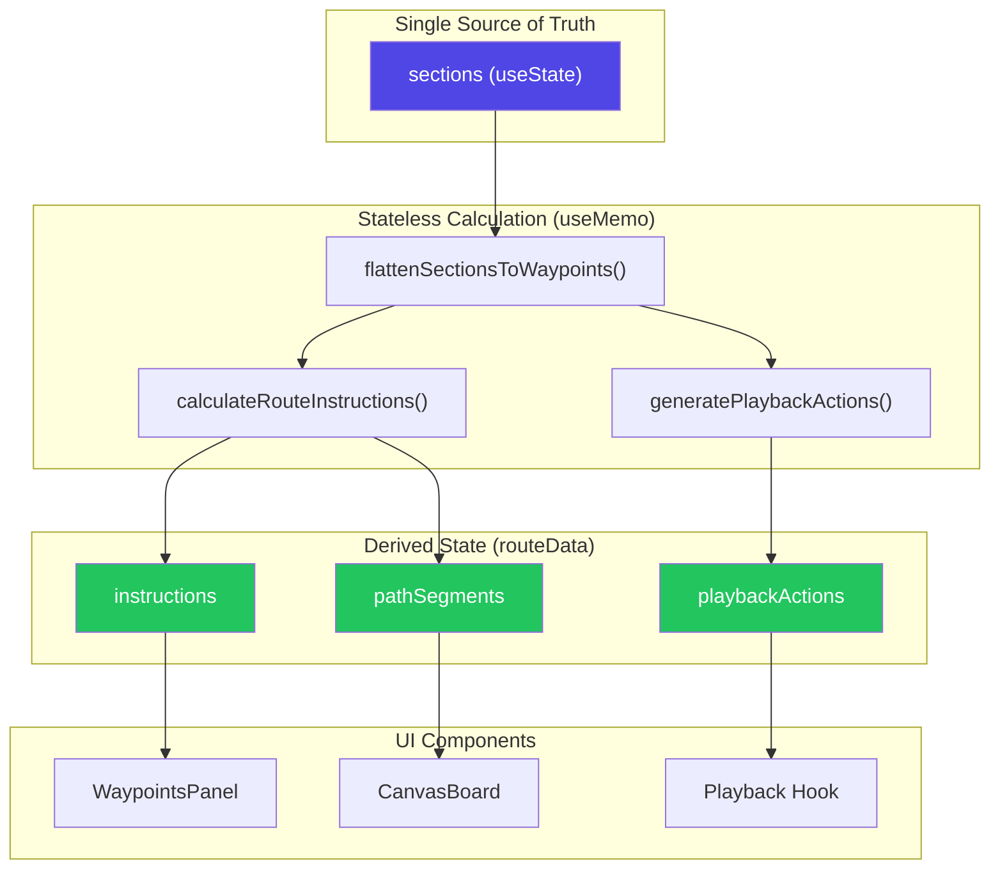

# WRO Path Planner - Architecture Status

> **Last Updated:** 2026-01-19  
> **Refactor:** Stateless / Rubber-Band Architecture

---

## 📁 Project Structure

```
src/wro-planner/
├── WROPlaybackPlanner.jsx      # [MODIFIED] Parent component with useMemo-based route calculation
├── WaypointsPanel.jsx          # [NEW] UI for displaying instructions grouped by section
├── WaypointsPanel.css          # [NEW] Styles for WaypointsPanel
├── SectionsPanel.jsx           # [EXISTING] Section management UI
├── CanvasBoard.jsx             # [EXISTING] Canvas drawing & visualization
├── TopBar.jsx                  # [EXISTING] Toolbar
├── OptionsPanel.jsx            # [EXISTING] Settings panel
│
├── domain/
│   ├── pathCalculator.js       # [NEW] Core stateless route calculation logic
│   ├── pathCalculator.test.js  # [NEW] Unit tests (32 passing)
│   ├── geometry.js             # [EXISTING] Math utilities
│   ├── playback.js             # [EXISTING] Animation hook
│   ├── constants.js            # [EXISTING] Constants & presets
│   └── sections_stable.js      # [LEGACY] Old section recalculation logic
```

---

## 🔄 Data Flow Diagram



**Text-based alternative:**

```
┌─────────────────────────────────────────────────────────────────┐
│                     USER ACTIONS                                 │
│  (Draw, Delete Section, Edit Waypoint, Import Mission)          │
└───────────────────────────┬─────────────────────────────────────┘
                            │
                            ▼
┌─────────────────────────────────────────────────────────────────┐
│              sections (useState) - SINGLE SOURCE OF TRUTH       │
│  [{id, name, points[], actions[], color, isVisible}, ...]       │
└───────────────────────────┬─────────────────────────────────────┘
                            │
                            ▼
┌─────────────────────────────────────────────────────────────────┐
│                    useMemo (routeData)                          │
│  ┌─────────────────────────────────────────────────┐            │
│  │ 1. flattenSectionsToWaypoints(sections)         │            │
│  │    → [{id, x, y, sectionId, sectionColor}, ...] │            │
│  │                                                 │            │
│  │ 2. calculateRouteInstructions(pose, waypoints)  │            │
│  │    → {instructions, pathSegments, poses}        │            │
│  │                                                 │            │
│  │ 3. generatePlaybackActions(pose, waypoints)     │            │
│  │    → [{type:'rotate', angle}, {type:'move'}...] │            │
│  └─────────────────────────────────────────────────┘            │
└───────────────────────────┬─────────────────────────────────────┘
                            │
        ┌───────────────────┼───────────────────┐
        ▼                   ▼                   ▼
┌───────────────┐   ┌───────────────┐   ┌───────────────┐
│ WaypointsPanel│   │  CanvasBoard  │   │  usePlayback  │
│ (instructions)│   │ (pathSegments)│   │  (actions)    │
└───────────────┘   └───────────────┘   └───────────────┘
```

---

## 🛡️ Stale Closure Fix (Critical Synchronization)

### The Bug
When deleting a middle section, the canvas updates correctly, but clicking "Play Mission" causes the robot to follow the OLD path (a "ghost path").

### Root Cause
React's stale closure problem: `startMission` in `usePlayback` captures the `sections` array at the time the function was created, not the current value.

### The Fix (3-Layer Protection)

```javascript
// 1. REF-BASED ACCESS - Always have latest data available
const routeDataRef = useRef({ waypoints: [], instructions: [], playbackActions: [] });
useEffect(() => { routeDataRef.current = routeData; }, [routeData]);

// 2. AUTO-STOP ON ROUTE CHANGE - Prevent playing dirty paths
useEffect(() => {
    if (previousRouteVersionRef.current !== routeVersion && isRunning) {
        console.log('[WROPlaybackPlanner] Route changed during playback - auto-stopping');
        stopPlayback();
    }
    previousRouteVersionRef.current = routeVersion;
}, [routeVersion, isRunning, stopPlayback]);

// 3. PRE-EMPTIVE STOP - Stop before modifying sections
const handleDeleteSection = useCallback((sectionId) => {
    if (isRunning) stopPlayback();  // ← CRITICAL
    setSections(prev => prev.filter(s => s.id !== sectionId));
}, [isRunning, stopPlayback]);
```

### Protection Points
| Operation | Auto-Stop Trigger |
|-----------|-------------------|
| Delete Section | `handleDeleteSection` calls `stopPlayback()` |
| Clear Section | `handleClearSection` calls `stopPlayback()` |
| Update Actions | `updateSectionActions` calls `stopPlayback()` |
| Toggle Visibility | `toggleSectionVisibility` calls `stopPlayback()` |
| Import Mission | `importMission` calls `stopPlayback()` |
| Route Change (any) | `useEffect` with `routeVersion` calls `stopPlayback()` |

---

## 🎯 The "Rubber-Band" / Stateless Explanation

### Why Deleting a Section No Longer Breaks the Path

**Before (Legacy Architecture):**
- Each section stored its own `actions[]` with absolute references
- Deleting a middle section left orphaned references
- The path would break because dependent data was out of sync

**After (Stateless Architecture):**
- The `sections` state is the **only source of truth**
- Route data is **derived** using `useMemo`, not stored
- When any section changes, **everything is recalculated from scratch**

**The Rubber-Band Effect:**
```
Before Deletion:     After Deletion:
                     
  A ──→ B ──→ C       A ──────────→ C
        ↑                    ↑
    (Delete B)        Path "snaps" to
                      connect A → C
```

The pathCalculator simply iterates through the remaining waypoints and calculates the new TURN/MOVE instructions. No manual "reconnection" is needed because:

1. `setSections(prev => prev.filter(s => s.id !== sectionId))`
2. This triggers `useMemo` dependency change
3. `routeData` is recalculated with the new sections
4. UI automatically updates with fresh data

---

## 📋 Change Log

| File | Status | Description |
|------|--------|-------------|
| `domain/pathCalculator.js` | **NEW** | Stateless route calculation: `calculateRouteInstructions()`, `generatePlaybackActions()`, `flattenSectionsToWaypoints()` |
| `domain/pathCalculator.test.js` | **NEW** | 32 unit tests for path calculation logic |
| `domain/playback.js` | **MODIFIED** | Exposed `startPlayback` for direct use with fresh actions |
| `WaypointsPanel.jsx` | **NEW** | UI component for displaying instructions grouped by section with accordion |
| `WaypointsPanel.css` | **NEW** | Styles matching existing SectionsPanel design |
| `WROPlaybackPlanner.jsx` | **MODIFIED** | Added `useMemo`-based `routeData`, ref-based access, custom mission handlers using `startPlayback` |
| `CanvasBoard.jsx` | **MODIFIED** | Now uses `calculatedPathSegments` prop instead of calculating paths internally |

---

## ✅ Key Features Implemented

- [x] **Stateless Calculation** - `pathCalculator.js` has no side effects
- [x] **useMemo Integration** - Route recalculates on section changes
- [x] **Section Grouping** - Instructions display with section colors
- [x] **Delete Section** - Rubber-band reconnection works
- [x] **Playback Actions** - Compatible with existing animation system
- [x] **Unit Tests** - 32 passing tests

---

## 🔮 Future Improvements

1. **Canvas Integration** - Pass `pathSegments` to CanvasBoard for overlay rendering
2. **Custom Playback** - Use `routeData.playbackActions` directly in `startMission`
3. **Undo/Redo** - State is simple enough to snapshot
4. **Performance** - Consider `useMemo` with fine-grained dependencies if needed
