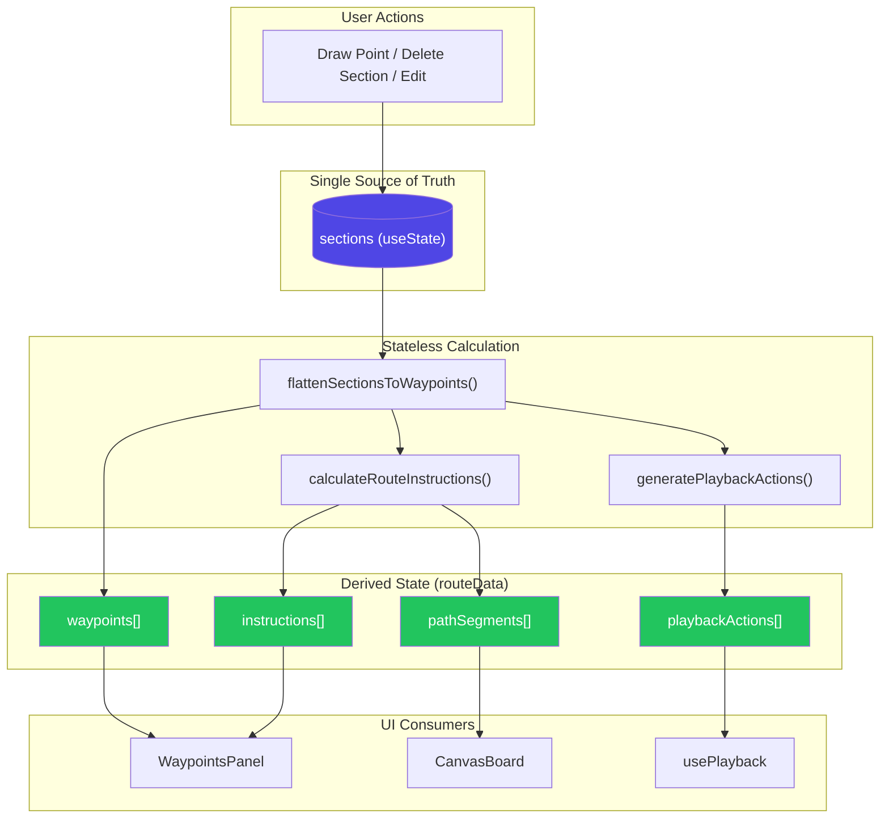

# WRO Path Planner - Project Status (Source of Truth)

> **Last Updated:** 2026-01-20  
> **Architecture:** Stateless / Rubber-Band  
> **Status:** Stable ✅

---

## 📖 Project Overview

The **WRO Path Planner** is a web-based robot path planning tool for World Robot Olympiad (WRO) competitions. It allows users to:

- **Draw waypoints** on a field canvas to define robot trajectories
- **Organize paths** into color-coded sections for multi-phase missions
- **Simulate playback** to visualize robot movement before competition
- **Export/Import** mission files for sharing and reuse

### Core Architecture Principles

| Principle | Description |
|-----------|-------------|
| **Single Source of Truth** | The `sections` state array is the only authoritative data |
| **Stateless Calculation** | Route data is *derived* via `useMemo`, never stored separately |
| **Rubber-Band Path Healing** | Deleting a middle section auto-reconnects the path |
| **Ref-Based Playback Sync** | `routeDataRef` prevents stale closures in animation |

---

## 📁 File Structure Tree

```
src/wro-planner/
├── WROPlaybackPlanner.jsx      # 🎯 CONTROLLER: Main app, state management, useMemo routing
├── CanvasBoard.jsx             # 🎨 VIEW: Dumb canvas renderer (receives props, no logic)
├── SectionsPanel.jsx           # 📋 UI: Section list management (add/delete/select)
├── WaypointsPanel.jsx          # 📋 UI: Instructions display grouped by section
├── TopBar.jsx                  # 🔧 UI: Toolbar with playback controls & actions
├── OptionsPanel.jsx            # ⚙️ UI: Settings (grid, robot size, units)
├── ShortcutsModal.jsx          # ⌨️ UI: Keyboard shortcuts help modal
├── icons.jsx                   # 🎨 UI: SVG icon components
│
├── domain/                     # 🧠 BUSINESS LOGIC (pure functions)
│   ├── pathCalculator.js       # ⭐ CORE: Stateless route calculation
│   ├── pathCalculator.test.js  # ✅ Unit tests (32 passing)
│   ├── geometry.js             # 📐 Math utilities (angles, poses, projections)
│   ├── playback.js             # ▶️ usePlayback hook (animation primitives)
│   ├── constants.js            # 📏 Field presets, defaults, units
│   ├── robotConfigStorage.js   # 💾 LocalStorage for robot config
│   ├── sections.js             # Section utilities
│   ├── sections_stable.js      # 🔒 Stable section recalculation (DO NOT MODIFY)
│   └── collision/              # Collision detection utilities
│
├── components/
│   ├── RobotSizeModal.jsx      # 🤖 Modal for robot dimensions
│   └── RobotSizePreview.jsx    # 🤖 Visual robot size preview
│
└── hooks/
    └── useBreakpoint.js        # 📱 Responsive breakpoint hook
```

### File Responsibilities

| File | Role | Key Exports |
|------|------|-------------|
| `WROPlaybackPlanner.jsx` | **Controller** | Main component, `sections` state, `routeData` useMemo |
| `pathCalculator.js` | **Math Logic** | `calculateRouteInstructions()`, `flattenSectionsToWaypoints()`, `generatePlaybackActions()` |
| `CanvasBoard.jsx` | **Dumb Renderer** | Receives `calculatedPathSegments` prop, draws everything |
| `playback.js` | **Animation** | `usePlayback()` hook, `startPlayback()`, `stopPlayback()` |
| `sections_stable.js` | **Recalculation** | `recalcSectionsFromPointsStable()` - DO NOT MODIFY |

---

## 🔄 Architecture & Data Flow

### 1️⃣ Single Source of Truth: `sections` State

All path data lives in a single React state array:

```javascript
const [sections, setSections] = useState([{
    id: 'sec_xxx',        // Unique ID
    name: 'Sección 1',    // Display name
    points: [],           // Waypoints: [{x, y, reverse}, ...]
    actions: [],          // Commands: [{type: 'rotate', angle}, {type: 'move', distance}]
    color: '#0000FF',     // Section color
    isVisible: true       // Visibility toggle
}]);
```

> **Rule:** Never store derived data separately. Always recalculate from `sections`.

---

### 2️⃣ Stateless Calculation: `useMemo` → `routeData`

```javascript
const routeData = useMemo(() => {
    // 1. Flatten sections to waypoints array
    const waypoints = flattenSectionsToWaypoints(sections.filter(s => s.isVisible));
    
    // 2. Calculate route instructions (TURN/MOVE)
    const { instructions, pathSegments } = calculateRouteInstructions(
        initialPose, waypoints, pixelsPerUnit
    );
    
    // 3. Generate playback animation actions
    const playbackActions = generatePlaybackActionsFromCalc(
        initialPose, waypoints, pixelsPerUnit
    );
    
    return { waypoints, instructions, pathSegments, playbackActions };
}, [sections, initialPose, pixelsPerUnit]);  // ← Dependencies
```

**Why this matters:**
- Changing `sections` automatically triggers recalculation
- No manual "sync" or "update" calls needed
- Impossible to have stale derived data

---

### 3️⃣ Playback Synchronization: The `routeDataRef` Pattern

**The Problem:** React closures capture state at creation time. If `handleStartMission` captures `routeData` directly, it may use stale data if sections change before play.

**The Solution:** A ref that's always updated to the latest value.

```javascript
// 1. REF that always holds latest data
const routeDataRef = useRef({ waypoints: [], playbackActions: [] });

// 2. SYNC on every change
useEffect(() => {
    routeDataRef.current = routeData;
}, [routeData]);

// 3. READ from ref, not closure
const handleStartMission = useCallback(() => {
    const latestRouteData = routeDataRef.current;  // ← FRESH data!
    startPlayback(latestRouteData.playbackActions, initialPose);
}, [startPlayback, initialPose]);
```

---

### 4️⃣ Data Flow Diagram



#### Text-Based Alternative

```
┌─────────────────────────────────────────────────────────────────┐
│                       USER ACTIONS                              │
│  (Draw Point, Delete Section, Edit Waypoint, Import Mission)   │
└───────────────────────────┬─────────────────────────────────────┘
                            │ setSections(...)
                            ▼
┌─────────────────────────────────────────────────────────────────┐
│              sections (useState) - SINGLE SOURCE OF TRUTH       │
│  [{id, name, points[], actions[], color, isVisible}, ...]       │
└───────────────────────────┬─────────────────────────────────────┘
                            │ useMemo dependency
                            ▼
┌─────────────────────────────────────────────────────────────────┐
│                    routeData = useMemo(...)                     │
│  ┌─────────────────────────────────────────────────┐            │
│  │ 1. flattenSectionsToWaypoints(sections)         │            │
│  │    → [{id, x, y, sectionId, sectionColor}, ...] │            │
│  │                                                 │            │
│  │ 2. calculateRouteInstructions(pose, waypoints)  │            │
│  │    → {instructions, pathSegments}               │            │
│  │                                                 │            │
│  │ 3. generatePlaybackActions(pose, waypoints)     │            │
│  │    → [{type:'rotate', angle}, {type:'move'}...] │            │
│  └─────────────────────────────────────────────────┘            │
└───────────────────────────┬─────────────────────────────────────┘
                            │
        ┌───────────────────┼───────────────────┐
        ▼                   ▼                   ▼
┌───────────────┐   ┌───────────────┐   ┌───────────────┐
│ WaypointsPanel│   │  CanvasBoard  │   │  usePlayback  │
│ (instructions)│   │ (pathSegments)│   │  (actions)    │
└───────────────┘   └───────────────┘   └───────────────┘
```

---

## 🎯 Key Features & Logic

### 🎢 Rubber-Band Effect (Auto-Healing Path)

When a middle section is deleted, the path automatically "snaps" to connect the remaining waypoints.

```
Before Deletion:          After Deletion:
                          
  A ──→ B ──→ C            A ──────────→ C
        ↑                        ↑
    (Delete B)             Path "snaps" to
                           connect A → C directly
```

**How it works:**
1. `setSections(prev => prev.filter(s => s.id !== sectionId))`
2. `useMemo` detects dependency change
3. `routeData` recalculates with remaining sections
4. UI updates automatically

> **No manual reconnection logic needed!** The stateless calculator simply iterates through whatever waypoints exist.

---

### 🔄 Direction Toggle (Reverse Movement)

Users can toggle between forward and reverse movement for individual waypoints:

| Action | Scope | Behavior |
|--------|-------|----------|
| **Space** key (no selection) | Global | Toggles `reverseDrawing` for NEW points |
| **Space** key (with selection) | Specific node | Toggles `point.reverse` for THAT waypoint |
| **Button click** | Same as Space | Same behavior as keyboard |

```javascript
const handleToggleReverse = useCallback(() => {
    if (selectedNode && selectedNode.index >= 0) {
        // Toggle reverse for the selected waypoint
        setSections(prev => prev.map(s => {
            if (s.id !== selectedNode.sectionId) return s;
            const newPoints = s.points.map((p, i) => 
                i === selectedNode.index ? { ...p, reverse: !p.reverse } : p
            );
            return { ...s, points: newPoints };
        }));
        // Then recalculate actions
    } else {
        // Toggle global reverseDrawing for new points
        setReverseDrawing(prev => !prev);
    }
}, [selectedNode, ...]);
```

---

### 🎨 Canvas Rendering (Dumb Component)

`CanvasBoard.jsx` is intentionally a "dumb" renderer:

```javascript
// CanvasBoard receives data via props - NO internal calculation
<CanvasBoard
    sections={sections}                    // For drawing points
    calculatedPathSegments={routeData.pathSegments}  // Pre-calculated lines
    playPose={playPose}                   // Current animation pose
    // ... other display props
/>
```

**Why?**
- Easier to test (predictable inputs → predictable output)
- Single source of truth remains in controller
- Canvas re-renders when props change (React handles it)

---

## 🔒 Recent Critical Fixes (DO NOT TOUCH)

> [!CAUTION]
> The following fixes address subtle bugs that are easy to accidentally reintroduce.
> **Do not modify or remove this code without understanding the consequences.**

### Fix 1: Stop Playback on Edit

**Problem:** Editing sections during playback causes robot to follow "ghost path" (old data).

**Solution:** Every section-modifying handler calls `stopPlayback()` first.

```javascript
// ✅ Pattern applied to ALL editing operations
const handleDeleteSection = useCallback((sectionId) => {
    if (isRunning) stopPlayback();  // ← CRITICAL
    setSections(prev => prev.filter(s => s.id !== sectionId));
}, [isRunning, stopPlayback]);
```

**Protected operations:**
- `handleDeleteSection`
- `handleClearSection`
- `updateSectionActions`
- `removeLastPointFromCurrentSection`
- `toggleSectionVisibility`
- `importMission`
- `handleToggleReverse`

---

### Fix 2: Auto-Stop on Route Change

**Problem:** If route changes while playback is running (external trigger), robot still follows old path.

**Solution:** `useEffect` watches route version and auto-stops.

```javascript
const routeVersion = useMemo(() => {
    const wps = routeData.waypoints;
    if (wps.length === 0) return 0;
    return wps.length * 10000 + Math.floor((last?.x || 0));
}, [routeData.waypoints]);

useEffect(() => {
    if (previousRouteVersionRef.current !== routeVersion && isRunning) {
        console.log('[WROPlaybackPlanner] Route changed during playback - auto-stopping');
        stopPlayback();
    }
    previousRouteVersionRef.current = routeVersion;
}, [routeVersion, isRunning, stopPlayback]);
```

---

### Fix 3: Ref-Based Playback Start

**Problem:** `handleStartMission` closure captures `routeData` at creation time, leading to stale data.

**Solution:** Read from `routeDataRef.current` instead of closure variable.

```javascript
// ❌ WRONG: Captures routeData from closure (may be stale)
const handleStartMission = useCallback(() => {
    startPlayback(routeData.playbackActions, initialPose);
}, [routeData, startPlayback, initialPose]);

// ✅ CORRECT: Reads from ref (always fresh)
const handleStartMission = useCallback(() => {
    const latestRouteData = routeDataRef.current;  // ← FRESH
    startPlayback(latestRouteData.playbackActions, initialPose);
}, [startPlayback, initialPose]);
```

---

### Fix 4: Keyboard Shortcut Priority

**Problem:** Space key should toggle reverse for selected node, but was being captured by other handlers.

**Solution:** Check `selectedNode` first before falling back to global toggle.

```javascript
const handleToggleReverse = useCallback(() => {
    if (selectedNode && selectedNode.sectionId && selectedNode.index >= 0) {
        // ✅ Toggle specific waypoint reverse
        // ...
    } else {
        // ✅ Fallback to global reverseDrawing
        setReverseDrawing(prev => !prev);
    }
}, [selectedNode, ...]);
```

---

## ⌨️ Keyboard Shortcuts Reference

| Category | Key | Action |
|----------|-----|--------|
| **Editing** | `Space` | Toggle direction (Forward/Reverse) for selected waypoint |
| | `Delete` / `Backspace` | Delete selected waypoint or section |
| | `Esc` | Deselect / Cancel current action |
| | `Tab` | Toggle Draw/Edit mode |
| **Navigation** | `+` / `-` | Zoom In / Zoom Out |
| | `Mouse Wheel` | Zoom canvas |
| | `Middle Click + Drag` | Pan canvas |
| | `↑` / `↓` | Select previous/next section |
| **Drawing** | `Q` | Toggle Snap 45° |
| | `R` | Toggle reference Center/Tip |
| | `O` | Show/hide ghost robot at 100% |
| | `A` | Add new section |

---

## ✅ Test Coverage

The `pathCalculator.js` module has **32 unit tests** covering:

- Empty input handling
- Single/multiple waypoint calculations
- Angle normalization
- Direction (forward/reverse) logic
- Section flattening
- Instruction grouping

Run tests:
```bash
npm test -- --testPathPattern=pathCalculator
```

---

## 🔮 Future Considerations

1. **Undo/Redo** - State is simple enough to snapshot
2. **Performance** - Consider fine-grained `useMemo` dependencies for very large paths
3. **Collision Detection** - Placeholder in `domain/collision/`
4. **Multi-Robot Support** - Would require sections-per-robot separation

---

## 📚 Related Documentation

- [ARCHITECTURE_STATUS.md](./ARCHITECTURE_STATUS.md) - Original architecture notes
- [domain/pathCalculator.js](./src/wro-planner/domain/pathCalculator.js) - Inline JSDocs

---

*This document serves as the canonical reference for the WRO Path Planner architecture. Update it when making significant changes.*
